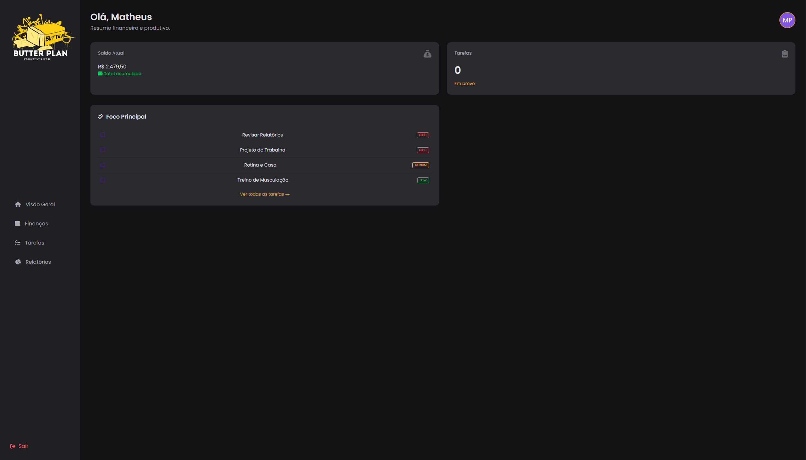
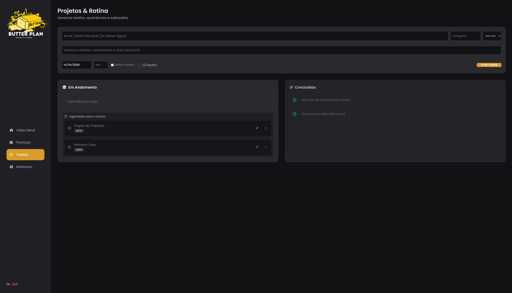
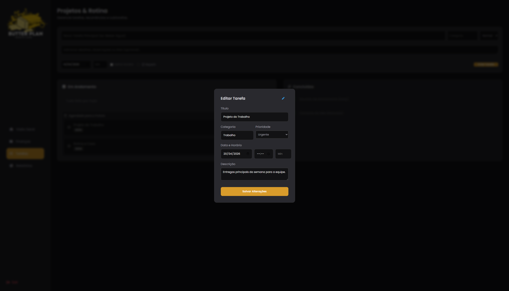
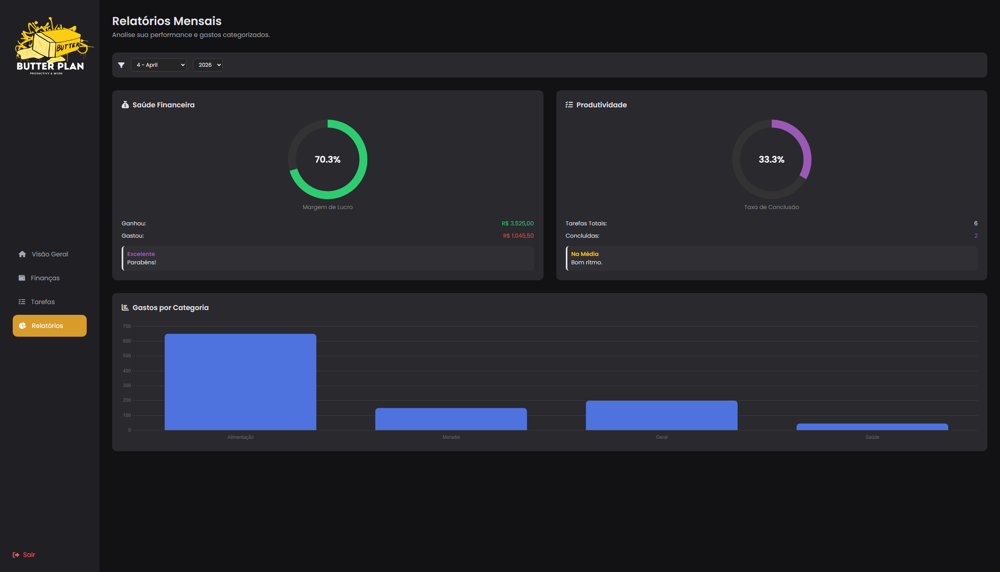
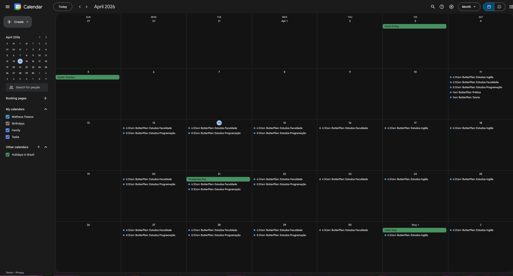
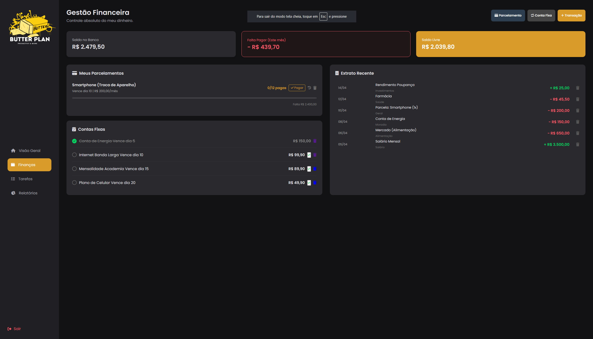

# 🧈 ButterPlan

> "A Bagunça da vida adulta com a usabilidade de uma criança. Uma Dashboard pessoal para unificar sua produtividade e gestão financeira."

## 💡 A Origem (Por que eu criei o ButterPlan?)
A ideia inicial do ButterPlan nasceu de uma necessidade estritamente pessoal. Como estudante de tecnologia, minha rotina estava fragmentada: eu usava um app para rastrear os estudos de programação, outro para listar as metas de inglês, uma planilha solta para o controle financeiro e o Google Agenda para os compromissos. 

Essa troca constante de contexto estava matando meu "Deep Work". O ButterPlan foi desenvolvido para ser a minha central de comando definitiva: um lugar onde eu pudesse gerenciar meu tempo, meu dinheiro e minha evolução profissional sem distrações. E agora, ele está aberto aqui.

## 🎯 A Proposta
O ButterPlan não é apenas uma lista de tarefas. É um gerenciador de rotina inteligente que une a organização de atividades complexas (com tarefas e subtarefas) ao controle financeiro pessoal, tudo sincronizado automaticamente com a nuvem.

## ⏳ Melhorias Futuras 
- 📱 **Versão Mobile (App):** Desenvolvimento de um aplicativo para Android e iOS (explorando tecnologias como React Native ou Flutter). O objetivo é facilitar o acesso e a consulta de dados, justamente pelos smartphones serem indispensáveis no nosso dia a dia. 
- 🔔 **Notificações Push e Alertas:** Implementar lembretes nativos no celular para vencimentos de contas fixas e prazos de tarefas urgentes.

- 📊 **Módulo Avançado de Relatórios:** Geração de gráficos interativos de fluxo de caixa e histórico de produtividade 

## ✨ Funcionalidades Principais
- **Gestão Hierárquica de Tarefas:** Crie projetos cronômetrados e sincronizados com o nosso fuso-horário e vincule a subtarefas personalizadas para facilitar a execução.
- **Tarefas Recorrentes:** Automação de rotinas em dias específicos da semana.

##  📊 Relatórios e Insights
A visão analítica do sistema. Onde os dados brutos se transformam em informações úteis.
**Análise Visual:** Gráficos que facilitam o entendimento de onde o tempo está sendo investido e para onde o dinheiro está indo.

## - 🗓️ Sincronização Com o Google Calendar:
- ** Utilizando nativamente à API do Google Calendar. Criou ou apagou no ButterPlan? O seu celular o mantém atualizado na mesma hora.

- ## Controle Financeiro Integrado: 
- Acompanhamento de saldo,
-  fluxo de caixa, 
-  despesas fixas (com lembretes automáticos) e gestão inteligente de parcelamentos.
-  Controle de Parcelamentos: O sistema isola compras divididas, projetando automaticamente o impacto de cada parcela nos meses seguintes.
- Livro Caixa: Registro rápido de entradas e saídas do dia a dia.
  

## 🛠️ Tecnologias Utilizadas
- **Back-end:** PHP 8 (Arquitetura MVC / Front Controller)
- **Banco de Dados:** MySQL (Motor InnoDB)
- **Front-end:** HTML5, CSS3, JavaScript Vanilla
- **Integrações:** Google Calendar API (OAuth 2.0)
- **Servidor:** Apache

## 🧩 Os Problemas que o ButterPlan Resolve
1. **Fim do "Context Switching":** Ter tarefas e finanças na mesma tela reduz a ansiedade e aumenta o tempo de foco real.
2. **Adeus ao retrabalho:** Ao invés de preencher a agenda do Google na mão e depois anotar no planner, o sistema automatiza essa ponte.
3. **Visão Financeira Clara:** O módulo de parcelas evita sustos no fim do mês, projetando o impacto das compras a longo prazo.

## ⚙️ Para Desenvolvedores e Recrutadores
Este documento é uma visão geral do produto. Se você deseja entender a fundo a arquitetura do sistema, as decisões de design de código (Clean Code, rotas, chaves estrangeiras) e os desafios técnicos resolvidos durante o desenvolvimento, confira a documentação técnica abaixo:

👉 **Em Breve ...   [Documentação Técnica Completa (Deep Dive) da Arquitetura do ButterPlan](./DOC_TECNICA.md)**

---
*Desenvolvido por [Matheus Passos].*
